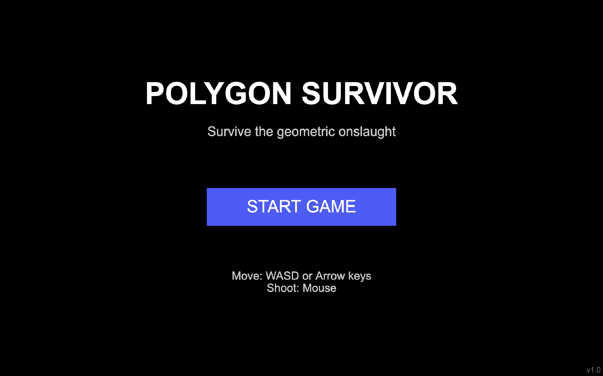
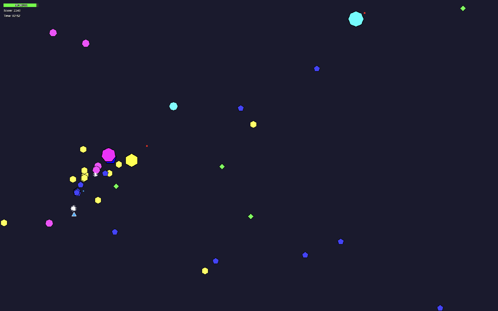
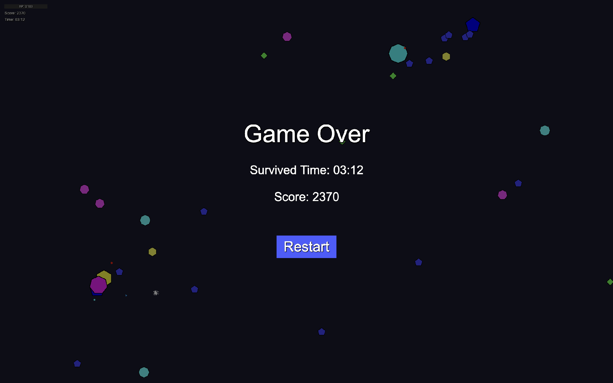
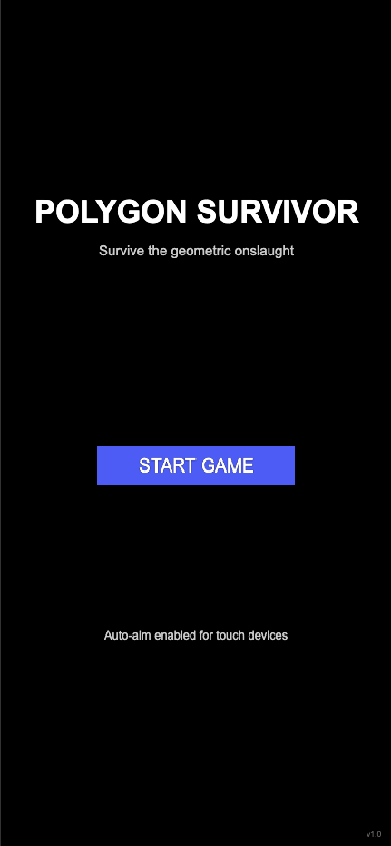
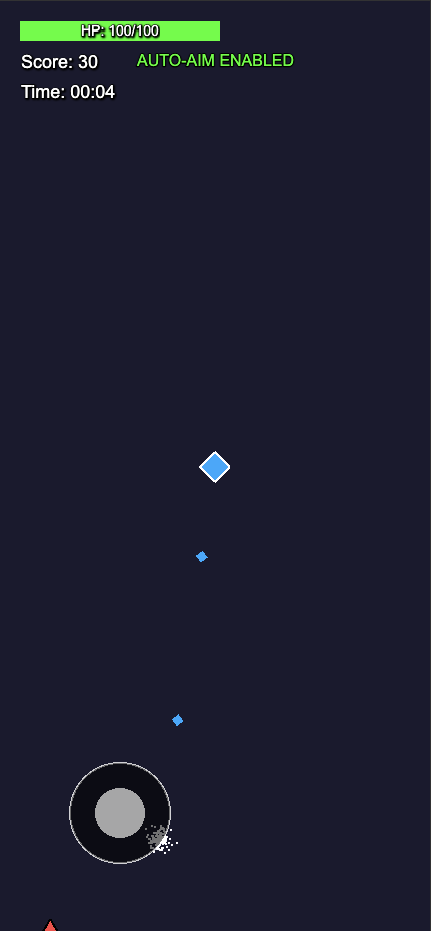
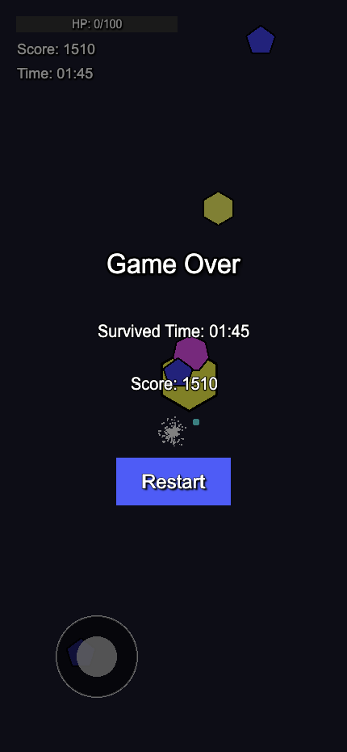

# Polygons Survivor

*A geometric survival shooter game built with Phaser 3.*  
This is a personal project where you control a polygon and try to survive as long as possible against waves of enemy shapes. 

[Play the game here](https://eugenemartinez.github.io/polygons-shooter-game/)

## Game Screenshot  

## About the Project  

**Polygons Survivor** is a little game I built to explore game development with Phaser 3. The concept is simple—you're a polygon trying to survive in a world of hostile shapes. The more complex the enemy shape (more sides), the more difficult it becomes.

## Features  

- **Shape-based Gameplay**: The enemy polygon's number of sides affects the speed, and health.  
- **Progressive Difficulty**: Enemies get tougher and more numerous the longer you survive.  
- **Boss Encounters**: Face special larger enemies at intervals.  
- **Responsive Design**: Works on both desktop and mobile/tablet devices.  
- **Auto-aim for Mobile**: Touch devices get auto-aim functionality for easier play.  

## How to Play  

- **Survive**: Avoid enemy polygons while shooting them down.  
- **Score Points**: Destroy enemies to increase your score.  
- **Last as Long as Possible**: Your survival time is tracked.  

## Controls  

### Desktop  
- **Move**: `WASD` or Arrow keys  
- **Shoot**: Mouse pointer (aim and auto-fire)  

### Mobile/Tablet  
- **Move**: Virtual joystick (bottom-left)  
- **Shoot**: Auto-aim system targets the nearest enemy  

  
  
  

## Development Notes  

This game was built using:  
- **Phaser 3** for game logic and rendering  
- **JavaScript ES6**  
- **Responsive design principles** for cross-device play  

### The project demonstrates concepts like:  
- Object-oriented game development  
- Collision detection and physics  
- Game state management  
- Responsive UI design  
- Mobile-specific controls  

## Play the Game  

Open `index.html` in a modern web browser to start playing!

## Debug Controls  
- Press `I` to toggle **invincibility** (for testing).  

---

Built with ❤️ and lots of geometric shapes. This is a personal project, so feel free to fork, modify, or just enjoy playing!

[Play the game here](https://eugenemartinez.github.io/polygons-shooter-game/)